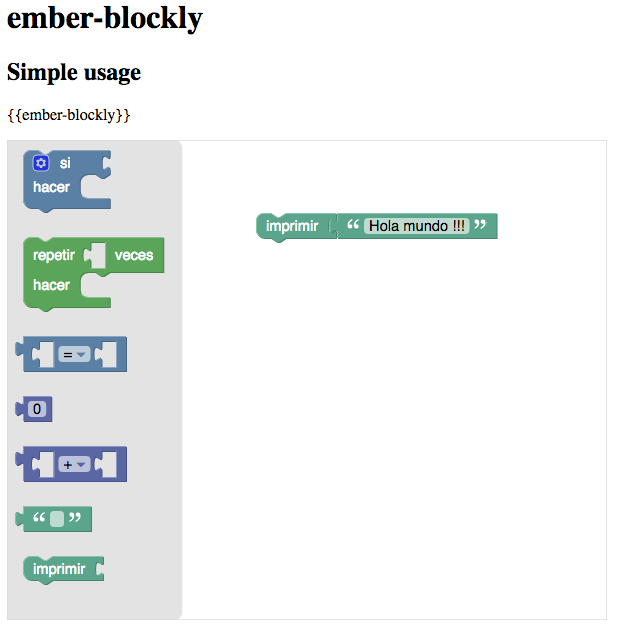

# ember-blockly

## demo site

- [http://ember-blockly.surge.sh](http://ember-blockly.surge.sh)

### Installation

* `git clone https://github.com/Program-AR/ember-blockly`
* `cd ember-blockly`
* `npm install`

### Running tests

* `ember test` – Runs the test suite on the current Ember version
* `ember test --server` – Runs the test suite in "watch mode"
* `ember try:each` – Runs the test suite against multiple Ember versions

### Running the dummy application

* `ember serve`
* Visit the dummy application at [http://localhost:4200](http://localhost:4200).

For more information on using ember-cli, visit [https://ember-cli.com/](https://ember-cli.com/).

License
------------------------------------------------------------------------------

This project is licensed under the [LGPL-3.0](LICENSE.md).
